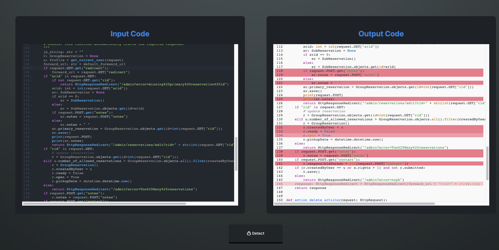

# VulDectector
This repository is still undergoing refactoring


## Getting started

### Install required packages
```
sh install.sh
```

### Run server

```
python be/app.py
```

### Run Client
```
cd fe
yarn dev
```

### Demo
Folder `examples` contain Python source files that contain vulnerabilities which are collected from GitHub issues in other projects.


 You can copy and paste source code of these example files into the input box and tap the detect button, the predicted vulnerable statements will be marked by red lines in the output box.
